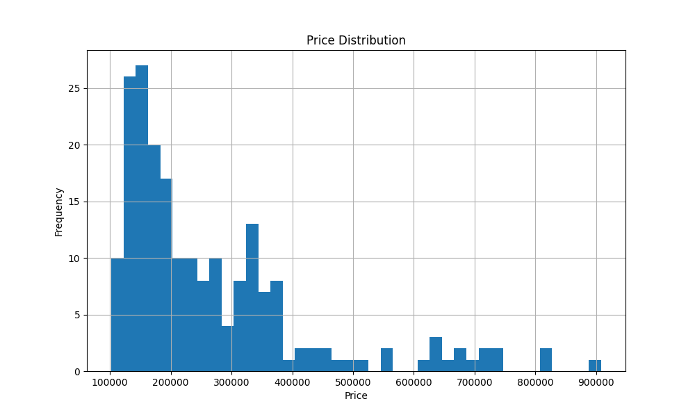
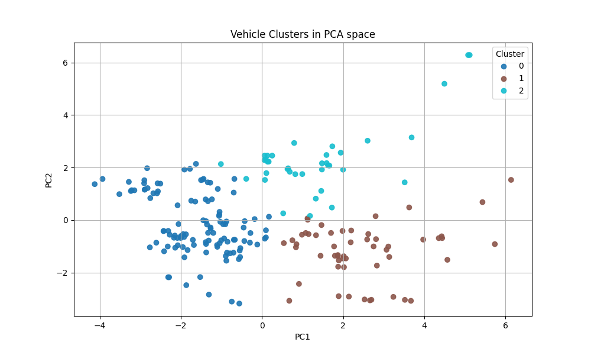
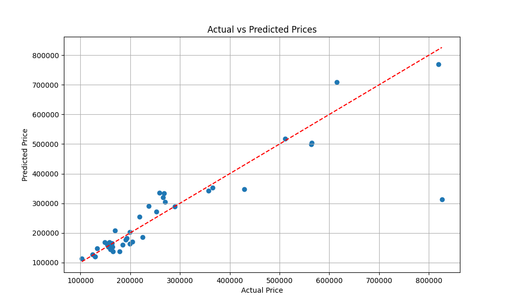
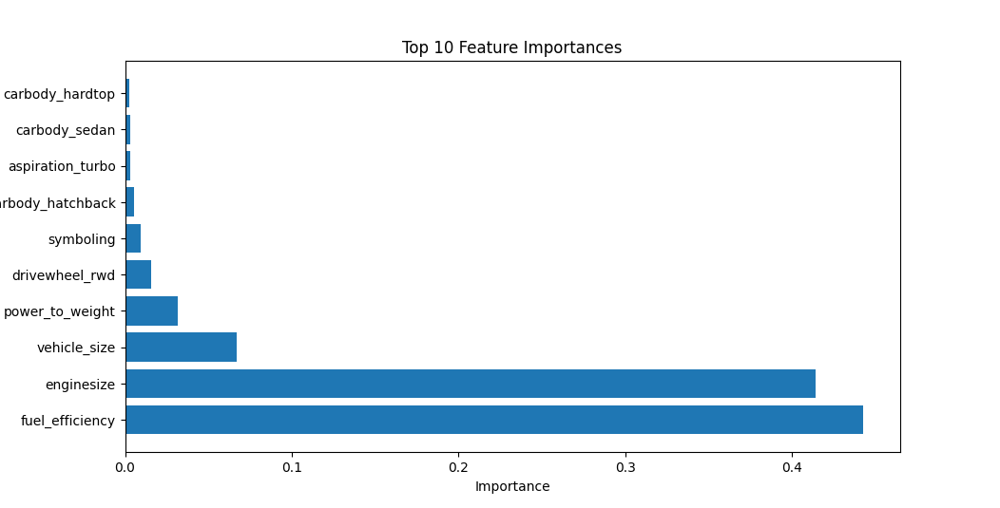
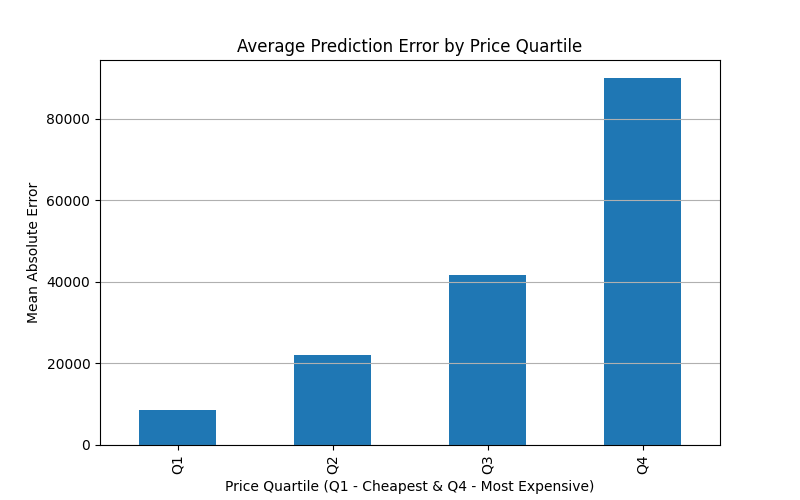

# Vehicle Valuation System

## Overview
End-to-end vehicle valuation system that estimates vehicle prices using machine learning. The system transforms raw vehicle data into price predictions through data preparation, feature engineering, market segmentation, model training, and error analysis.

## Business Problem
Mutuka Automotive needed a faster and more consistent way to estimate vehicle values. The goal was to develop a data driven system capable of providing reliable vehicle price estimates while identifying cases requiring manual review.

## Dataset
The dataset consists of vehicle specifications and corresponding vehicle prices. It includes features related to engine performance, fuel consumption, vehicle size, drivetrain and body type. Vehicle price was used as the target variable for prediction.

## Methodology

### Exploratory Data Analysis (EDA)
Key observations from the dataset:
- Vehicle prices were right-skewed, with a small number of premium vehicles.
- Horsepower, engine size and curb weight showed strong positive relationships with price.
- Higher cylinder counts were generally associated with higher vehicle values.
- Premium vehicles appeared as outliers and influenced price distributions.

### Data Cleaning
- Converted column names to lowercase.
- Removed the vehicle ID column.
- Filled missing numerical values using the median.
- Filled missing categorical values using the mode.
- Standardised categorical values by removing spaces and converting text to lowercase.

### Feature Engineering
New features were created to better represent vehicle performance and characteristics:
- Power-to-weight ratio = horsepower ÷ curb weight
- Fuel efficiency = average of city and highway MPG
- Vehicle size = length × width × height
- Brand extraction from vehicle names
- Log price transformation to reduce the effect of extreme vehicle prices
- Symboling standardisation for risk analysis

Categorical variables were converted into numerical format using dummy encoding.

### Market Segmentation
K-Means clustering was used to group vehicles with similar characteristics.

Three vehicle segments were identified and interpreted:
- Economy vehicles
- Mid-range vehicles
- Performance vehicles

PCA was used to visualise the clusters in two dimensions.

### Business Rules
Simple valuation rules were created to simulate a real-world vehicle valuation process.

Vehicles were classified using:
- Price bands
- Risk bands
- Performance bands

These rules were then used to assign valuation actions such as:
- Auto Approve
- Standard Manual Review
- High Risk Review
- High Value Review

### Price Prediction Models
Three machine learning models were trained and compared:
- Linear Regression
- K-Nearest Neighbours (KNN)
- Random Forest

An 80/20 train-test split was used for evaluation.
Vehicle prices were predicted using the log-transformed target variable and converted back to market prices for reporting.

## Results
Random Forest achieved the best performance and was selected as the final valuation model.
| Model             | MAE           |   R²   |
| ----------------- | --------------| -------|
| Linear Regression |    R48,789.96 | 0.68   |
| KNN               |    R57,478.93 | 0.59   |
| **Random Forest** | **R39,761.58**|**0.75**|

### Actual vs Predicted
The final model was able to capture most pricing patterns across the dataset, although prediction accuracy decreases for higher value vehicles.

### Feature Importance
Fuel efficiency and engine size were the strongest predictors of vehicle value in the dataset.

## Error Analysis
Model performance was analysed to understand where prediction errors occurred and identify situations where automated valuations may be unreliable.
### Error by Price Segment

| Segment           | Mean Absolute Error (R) |
| ----------------- | ----------------------: |
| Q1 Cheapest       |                   8,648 |
| Q2                |                  21,992 |
| Q3                |                  41,581 |
| Q4 Most Expensive |                  89,937 |

Prediction error increased consistently as vehicle prices increased. The model produced accurate estimates for lower-priced vehicles but became less reliable for premium vehicles, indicating that high-value vehicles require additional validation before valuation decisions are made.

## Case Study: Premium Vehicle Misvaluation
One of the largest prediction errors occurred for a premium vehicle in the test dataset.
| Metric          | Value    |
| --------------- | -------- |
| Actual Price    | R826,300 |
| Predicted Price | R313,974 |
| Absolute Error  | R512,326 |

The model underestimated the vehicle's value by more than R500,000.

This example highlights one of the limitations of the model: premium vehicles are uncommon in the training data and often possess unique characteristics that are difficult for the model to generalise. Rather than relying solely on automated predictions, vehicles identified as high-value are flagged for manual review through the business rules implemented earlier in the valuation process.

This shows how machine learning predictions and business rules can work together to improve decision quality.

## Business Impact

The system demonstrates how machine learning can support vehicle valuation by automating estimates for standard vehicles while identifying cases that require manual review.

This approach helps to:
- Reduce valuation time.
- Improve pricing consistency.
- Prioritise expert review for high-risk or high-value vehicles.
- Support more scalable valuation workflows.

## Key Findings
- Random Forest achieved the highest predictive performance, with an MAE of R39,761.58 and an R² of 0.75.
- Feature engineering improved the model's ability to capture differences in vehicle performance and size.
- K-Means clustering successfully separated vehicles into distinct market segments.
- Prediction accuracy decreased as vehicle prices increased, particularly for premium vehicles.
- Machine learning can support valuation decisions but should not fully replace human review.

## Future Improvements
- Hyperparameter tuning to improve model performance.
- Expand the dataset, particularly with premium vehicles, to improve valuation accuracy for high-value cars.
- Develop an interactive Streamlit application for end users.

## Stack Used
- Python
- Pandas
- NumPy
- Scikit-Learn
- Matplotlib
